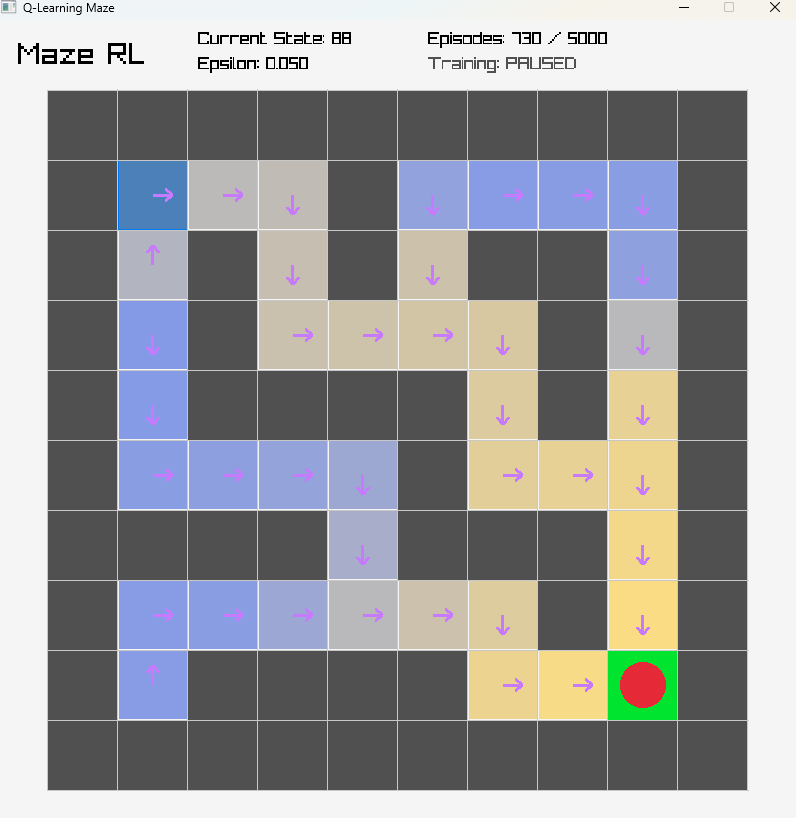

# Tabular Q-Learning vs DQN Maze

A native C and raylib teaching project that solves the same fixed 10 by 10 maze with two reinforcement-learning agents:

- tabular Q-learning with a 100 by 4 Q-table
- a dependency-free Deep Q-Network (DQN) implemented from scratch in C



The comparison is deliberately unfair to DQN in an instructive way. A Q-table is an excellent fit for this tiny, fully observable discrete environment. DQN can learn the same optimal policy, but needs a neural network, replay memory, minibatch optimization, and a target network to do it.

## Build and run

The Makefile expects the MSYS2 raylib installation at `C:/msys64/mingw64`. If GNU Make is installed:

```powershell
make
.\maze_rl.exe
```

The executable supports both the interactive raylib application and headless experiments. No external machine-learning library is required.

On the current Windows setup, where `gcc` is available but `make` is not on `PATH`, use:

```powershell
gcc -std=c11 -O2 -Wall -Wextra -pedantic src\main.c src\maze.c src\agent.c src\environment.c src\rl.c src\rng.c src\learner.c src\tabular.c src\dqn.c src\trainer.c src\benchmark.c src\generalization.c -o maze_rl.exe -IC:\msys64\mingw64\include -LC:\msys64\mingw64\lib -lraylib -lopengl32 -lgdi32 -lwinmm -lm
.\maze_rl.exe
```

## Interactive controls

| Input | Action |
| --- | --- |
| Arrow keys | Move the agent in human mode |
| `A` | Switch between the tabular and DQN learners |
| `H` | Enter human-control mode |
| `T` | Start or pause training for the selected learner |
| `D` | Demonstrate the selected learner's frozen greedy policy |
| `C` | Clear the selected model and its training state |
| `R` | Reset the visible agent position |
| `P` | Toggle learned-policy arrows |
| `V` | Toggle the Q-value heatmap |
| `+` / `-` | Adjust episodes trained per frame |

Switching learners preserves both models, their episode counts, and their metrics. Demonstrations use `epsilon = 0` and never update the model or replay buffer.

## Reproducible comparison

Run the default experiment (both learners, 5,000 episodes, 10 seeds):

```powershell
make benchmark
```

Or configure it directly:

```powershell
.\maze_rl.exe --benchmark --agent both --episodes 5000 --seeds 10 --seed 1 --csv comparison.csv
```

`--agent` accepts `tabular`, `dqn`, or `both`. The CSV records checkpoints every 100 episodes, including rolling training success, average successful path length, frozen greedy evaluation, elapsed CPU time, parameter count, and learner memory. Evaluation has its own deterministic RNG and therefore cannot change the subsequent training trajectory.

### Verified 10-seed result

The default 5,000-episode comparison was run for seeds 1 through 10:

| Agent | Optimal greedy runs | Greedy steps | Parameters | Learner memory | Mean CPU time/run |
| --- | ---: | ---: | ---: | ---: | ---: |
| Tabular | 10 / 10 | 14 | 400 | 1,608 bytes | 1.6 ms |
| DQN | 10 / 10 | 14 | 6,724 | 307,628 bytes | 2,900.3 ms |

Both agents had solved the maze by the first 100-episode evaluation checkpoint in every seed. The result illustrates the intended lesson: DQN reaches the same policy, but this fixed discrete maze gives it no generalization benefit to offset its substantially greater computation and memory.

## Held-out maze generalization experiment

The single-maze DQN cannot genuinely generalize because its one-hot input contains only the agent's position. The same position in two different mazes produces the same observation even when walls require different actions. A separate headless experiment tests that limitation, a more informative observation, and an architecture with spatial weight sharing:

- **Position-only baseline:** a 144-element one-hot position in a padded 12 by 12 space.
- **Layout-aware MLP:** a 13 by 13 agent-centered crop with wall and goal channels, plus normalized goal displacement. This produces 340 inputs and works with every tested size up to 12 by 12.
- **Convolutional DQN:** the same layout observation processed by two shared 3 by 3 convolution stages and a 64-unit Q-value head.

The deterministic suite contains:

- 16 training mazes, all 10 by 10
- 6 unseen 10 by 10 mazes to test new layouts
- 6 unseen 8 by 8 mazes to test smaller layouts
- 6 unseen 12 by 12 mazes to test larger layouts

Every generated maze is validated with breadth-first search and its optimal route length is recorded. Training samples only the 16 training mazes; held-out mazes never enter replay and never update the network.

Run the default three-seed experiment with:

```powershell
.\maze_rl.exe --generalization --episodes 5000 --seeds 3 --seed 1 --csv generalization.csv
```

or, with GNU Make:

```powershell
make generalization
```

The CSV includes the reproducible maze-generation seed, split, dimensions, BFS-optimal steps, success, actual steps, optimality gap, return, training time, and model size.

### Three-seed result and interpretation

A 5,000-episode run with learner seeds 1 through 3 produced:

| Observation | Training 10 by 10 | Unseen 10 by 10 | Unseen 8 by 8 | Unseen 12 by 12 | All unseen |
| --- | ---: | ---: | ---: | ---: | ---: |
| Position only | 0 / 48 | 0 / 18 | 0 / 18 | 0 / 18 | 0 / 54 |
| Layout-aware MLP | 48 / 48 | 1 / 18 | 1 / 18 | 0 / 18 | 2 / 54 |
| Convolutional | 48 / 48 | 5 / 18 | 6 / 18 | 1 / 18 | 12 / 54 |

The MLP result is evidence of memorization. Convolution raised held-out success from 3.7% to 22.2% while reducing parameter count from 22,084 to 13,624, showing that spatial weight sharing is a better inductive bias for this task. It still failed most held-out evaluations, especially larger mazes, so the next controlled experiment should keep the convolutional architecture fixed and broaden the procedural training distribution.

### Render the convolutional learning video

https://github.com/user-attachments/assets/d2289297-ace0-47bc-bece-839ec993c1c7

## Algorithms

The complete training flow is available as a Graphviz diagram in [`assets/dqn_algorithm.dot`](assets/dqn_algorithm.dot). Render it after installing Graphviz with:

```powershell
dot -Tsvg assets/dqn_algorithm.dot -o assets/dqn_algorithm.svg
```

Both agents receive exactly the same transition:

```text
(state, action, reward, next state, done)
```

They share the maze, rewards, 200-step episode limit, discount factor (`0.95`), and epsilon schedule (`1.0` decaying to `0.05`).

The tabular update is:

```text
Q(s,a) <- Q(s,a) + alpha * [r + gamma * max Q(s',a') - Q(s,a)]
```

The DQN uses:

- a 100-element one-hot state input
- a `100 -> 64 ReLU -> 4` network (6,724 trainable parameters)
- He weight initialization
- a 10,000-transition circular replay buffer
- 500-transition warm-up and 32-transition minibatches
- Huber loss and Adam with learning rate `0.001`
- gradient-norm clipping at `10`
- a target network copied every 250 optimizer updates

One-hot input makes the baseline honest: it gives DQN the same state identity used by the Q-table without pretending flattened state numbers have meaningful numeric distance.

## Summary of mathematical formalisms

Let $s_t$ be the current state, $a_t \in \mathcal{A}$ one of the four actions, $\theta$ the online-network parameters, and $\theta^-$ the target-network parameters.

### Epsilon-greedy action selection

Exploration samples an action uniformly:

$$
a_t \sim \mathrm{Uniform}(\mathcal{A}).
$$

Exploitation selects an action with maximum online-network value:

$$
a_t \in \underset{a \in \mathcal{A}}{\arg\max}\;Q(s_t,a;\theta).
$$

The implementation randomly selects among exact maximizing ties. Combining exploration and exploitation gives:

$$
a_t =
\begin{cases}
\text{uniform random action}, & u < \epsilon,\\
\text{random member of }\arg\max_a Q(s_t,a;\theta), & u \ge \epsilon,
\end{cases}
\qquad u \sim \mathrm{Uniform}[0,1).
$$

### Bellman optimality target

For replay transition $j$, let $d_j=1$ indicate termination. The fixed target-network value is:

$$
y_j =
\begin{cases}
r_j, & d_j = 1,\\
r_j + \gamma\displaystyle\max_{a' \in \mathcal{A}}
Q(s'_j,a';\theta^-), & d_j = 0,
\end{cases}
\qquad \gamma = 0.95.
$$

The terminal branch deliberately contains no future value because no action occurs after reaching the goal.

### Minibatch Huber loss

For a uniformly sampled replay minibatch $B$, define the temporal-difference error:

$$
e_j = y_j - Q(s_j,a_j;\theta).
$$

The implementation uses Huber loss with threshold $1$:

$$
\mathrm{Huber}_1(e) =
\begin{cases}
\tfrac{1}{2}e^2, & |e| \le 1,\\
|e| - \tfrac{1}{2}, & |e| > 1,
\end{cases}
$$

$$
L(\theta) = \frac{1}{|B|}\sum_{j \in B}
\mathrm{Huber}_1\!\left(y_j-Q(s_j,a_j;\theta)\right),
\qquad |B|=32.
$$

### Gradient clipping and optimization

The minibatch gradient is clipped to Euclidean norm $10$, then passed to Adam:

$$
g = \nabla_\theta L(\theta),
\qquad
g_{\mathrm{clipped}} =
\begin{cases}
g, & \lVert g\rVert_2 \le 10,\\
\dfrac{10g}{\lVert g\rVert_2}, & \lVert g\rVert_2 > 10.
\end{cases}
$$

$$
\theta \leftarrow
\mathrm{Adam}\!\left(\theta,g_{\mathrm{clipped}};
\alpha=10^{-3},\beta_1=0.9,\beta_2=0.999,\varepsilon_{\mathrm{Adam}}=10^{-8}\right).
$$

### Periodic target-network copy

The target is held fixed between hard synchronization steps:

$$
\theta^- \leftarrow \theta
\qquad \text{every } C=250 \text{ optimizer updates}.
$$

### Exploration schedule

After each training episode:

$$
\epsilon \leftarrow
\max\!\left(\epsilon_{\min},\epsilon\lambda_\epsilon\right),
\qquad
\lambda_\epsilon=0.995,
\qquad
\epsilon_{\min}=0.05,
$$

starting from $\epsilon_0=1.0$.

### Network equations and tensor dimensions

For one-hot state vector $x(s)\in\mathbb{R}^{100}$:

$$
h = \mathrm{ReLU}(W_1x(s)+b_1),
\qquad
Q(s,\cdot;\theta)=W_2h+b_2,
$$

with:

$$
W_1\in\mathbb{R}^{64\times100},\quad
b_1\in\mathbb{R}^{64},\quad
W_2\in\mathbb{R}^{4\times64},\quad
b_2\in\mathbb{R}^{4}.
$$

Therefore the online network contains exactly

$$
(64\times100)+64+(4\times64)+4
=6{,}724.
$$

Thus, the online network has **6,724 trainable parameters**.

Weights use He initialization with variance $2/n_{\mathrm{in}}$:

$$
W_{ij} \sim \mathcal{N}\!\left(0,\frac{2}{n_{\mathrm{in}}}\right).
$$

After the online weights are initialized, the target network begins as an exact
copy of the online network:

$$
\theta^- \leftarrow \theta.
$$

## Tests

```powershell
make test
```

Tests cover environment transitions, replay wraparound, terminal targets, target copying, a finite-difference gradient check, deterministic tabular training, parameter counts, and end-to-end learning of the known optimal 14-action route by both agents.

## Source layout

```text
src/
|-- main.c              Interactive UI and command-line dispatch
|-- environment.c/.h   Shared rewards and transitions
|-- learner.c/.h       Common learner interface
|-- tabular.c/.h       Tabular Q-learning
|-- dqn.c/.h           Neural network, replay, target network, and Adam
|-- trainer.c/.h       Shared episode and metric logic
|-- benchmark.c/.h     Seeded headless comparison and CSV export
|-- generalization.c/.h  Multi-maze and cross-size held-out experiment
|-- rng.c/.h           Deterministic project RNG
|-- maze.c/.h          Maze state and rendering
`-- agent.c/.h         Movement and model-independent visualization
```
